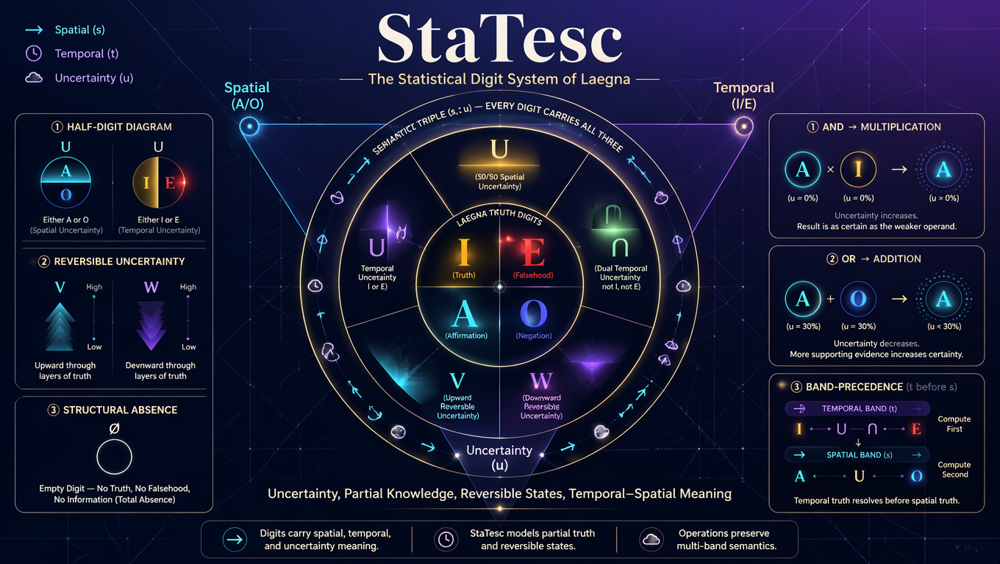
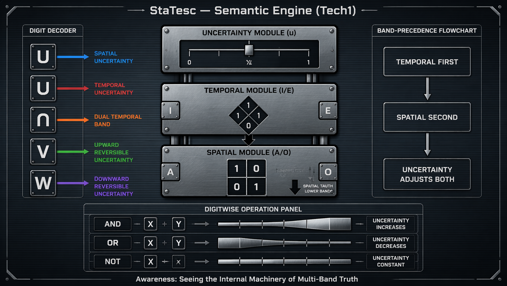
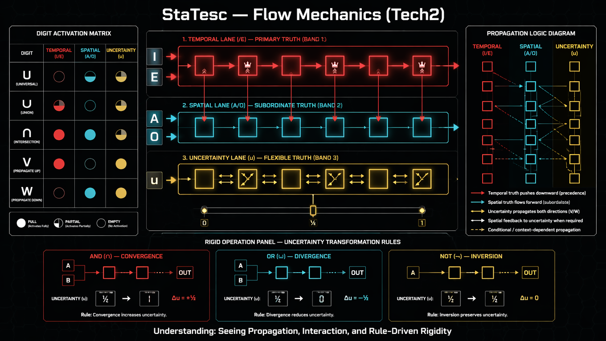
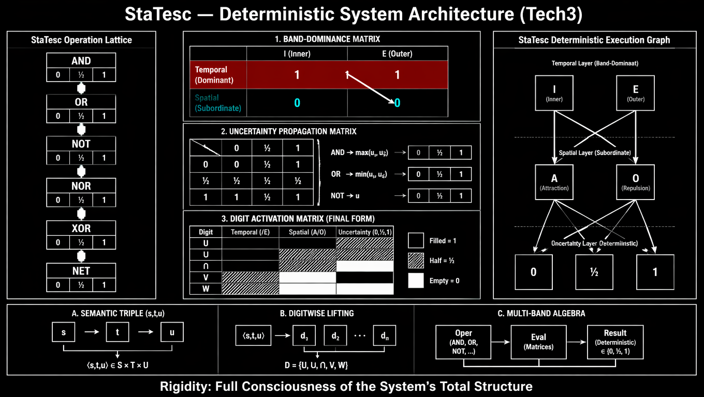
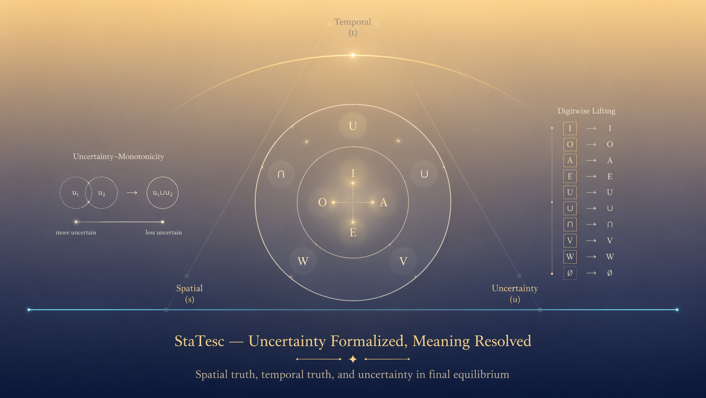

# @CoPilot: introductions@

# StaTesc — Popular‑Science Introduction

StaTesc is a way of writing numbers and logic that understands uncertainty.  
In everyday life, we often know *part* of the truth, or we know something is “either this or that,” or we have information that matters only in the future.  
StaTesc gives special digits for these situations.

---

# 1. What StaTesc Adds to Normal Numbers

StaTesc introduces digits like:

- $U$ — “either A or O,” a 50/50 spatial uncertainty,  
- $\cup$ — “either I or E,” a 50/50 temporal uncertainty,  
- $V$ and $W$ — reversible uncertainty that moves upward or downward in meaning,  
- $\varnothing_{\text{digit}}$ — a digit that does not exist at all.

These digits let you write numbers that carry uncertainty directly inside them.

---

# 2. Why This Matters

Real life is full of incomplete information:
- you don’t know which option is correct,  
- you know something but it doesn’t affect the final result,  
- you know the direction but not the outcome,  
- you have missing data.

StaTesc lets you calculate with these situations instead of ignoring them.

---

# 3. How StaTesc Works

Every digit has three parts:
- spatial meaning ($A/O$),  
- temporal meaning ($I/E$),  
- uncertainty ($u$).

When you combine digits using AND, OR, NOT, or other operations, StaTesc updates all three parts in a consistent way.  
Temporal meaning takes precedence over spatial meaning, and uncertainty grows or shrinks depending on the operation.

---

# 4. What Beginners Can Do

With just a few rules, beginners can:
- combine uncertain values,  
- model decisions with missing information,  
- represent “either/or” states,  
- track how uncertainty changes.

StaTesc behaves like normal logic and arithmetic, but with uncertainty built in.

---

# 5. What Advanced Users Can Do

Advanced users can build:
- multi‑layer logic systems,  
- reversible computations,  
- symbolic AI engines,  
- temporal–spatial reasoning models,  
- number systems that evolve over time.

StaTesc becomes a powerful tool for modeling complex systems where truth is not simply yes or no.

---

# 6. Summary

StaTesc is a way to write and compute with uncertainty.  
It extends everyday logic and arithmetic so that numbers and truth values can carry partial knowledge, reversible states, and temporal–spatial meaning.  
Beginners can use it to handle incomplete information; experts can use it to build advanced reasoning systems.

# Introduction to StaTesc — Real‑Life Meaning, Practical Use, and Advanced Possibilities

StaTesc is the statistical digit system of Laegna.  
It extends everyday logic and arithmetic with new digits that represent *uncertainty, partial knowledge, reversible states, and mixed temporal–spatial meaning*.  
This introduction explains what StaTesc is, why it matters in real life, how basic users can benefit from it, and what advanced users can eventually unlock.

StaTesc works on the digit set

$$
\mathcal{D} = \{I, O, A, E, U, \cup, \cap, V, W, \varnothing_{\text{digit}}\}
$$

where each digit has semantics

$$
\phi(d) = (s, t, u)
$$

with $s$ = spatial meaning, $t$ = temporal meaning, $u$ = uncertainty.

---

# 1. Why StaTesc Exists

Real life is full of situations where:
- you know *part* of the truth,  
- you know *one band* (spatial or temporal) but not the other,  
- you know something is *either A or O*, but not which,  
- you know something is *either I or E*, but not which,  
- you know something but it does not matter for the final result,  
- or you have a value that is *structurally absent*.

StaTesc gives **digits** for these cases.  
Instead of forcing everything into binary true/false or numeric values, StaTesc lets you write numbers and logic expressions that *carry uncertainty correctly*.

This makes StaTesc useful in:
- decision‑making,  
- probability reasoning,  
- AI logic,  
- game theory,  
- temporal reasoning,  
- systems with partial information,  
- and any domain where “unknown” is not just a blank but a meaningful state.

---

# 2. Real‑Life Features

StaTesc introduces several real‑life‑aligned concepts:

## 2.1 Half‑digits for partial knowledge
Digits like $U$ and $\cup$ represent “either A or O” or “either I or E” with $u = \tfrac{1}{2}$ uncertainty.

This models:
- incomplete data,  
- ambiguous choices,  
- 50/50 outcomes,  
- blended states (e.g., color mixing, partial truth).

## 2.2 Reversible uncertainty
Digits $V$ and $W$ represent uncertainty that spreads *upwards* or *downwards* in the positional band.

This models:
- unknown future effects,  
- known but irrelevant details,  
- reversible decisions,  
- constraints that resolve automatically.

## 2.3 Structural absence
The empty digit $\varnothing_{\text{digit}}$ models:
- missing data,  
- undefined states,  
- optional fields,  
- gaps in sequences.

It behaves differently from uncertainty: it is *not a digit*, but a placeholder.

## 2.4 Temporal vs spatial meaning
StaTesc distinguishes:
- spatial truth ($A/O$),  
- temporal truth ($I/E$).

This models:
- “what is true now” vs “what is true in general”,  
- “what direction something takes” vs “what outcome it leads to”,  
- “local” vs “global” truth.

---

# 3. What Basic or Intermediate Users Need Most

StaTesc is designed so that beginners can use only a few rules and still get meaningful results.

## 3.1 The three most important digits
- $U$ — spatial uncertainty  
- $\cup$ — temporal uncertainty  
- $\varnothing_{\text{digit}}$ — structural absence

These three cover most real‑life cases.

## 3.2 The three most important operations
- AND → multiplication  
- OR → addition  
- NOT → unary minus  

These behave similarly to familiar logic and arithmetic, but with uncertainty preserved.

## 3.3 The three most important axioms
- **Associativity** — you can group operations freely.  
- **Band‑precedence** — temporal meaning dominates spatial meaning.  
- **Uncertainty‑monotonicity** — AND increases uncertainty, OR decreases it.

With just these, users can:
- combine uncertain values,  
- reason about partial truth,  
- compute outcomes with missing data,  
- model simple decision trees.

---

# 4. What Advanced Use Enables

Advanced StaTesc users can unlock powerful capabilities.

## 4.1 Multi‑band reasoning
StaTesc supports reasoning across:
- spatial band,  
- temporal band,  
- positional band (R),  
- value band (T).

This enables:
- multi‑layer logic,  
- multi‑scale modeling,  
- systems that evolve over time.

## 4.2 Reversible logic and reversible arithmetic
Digits $V$ and $W$ allow operations where:
- uncertainty flows upward or downward,  
- results remain meaningful even if some digits are unknown,  
- some digits can be set arbitrarily without breaking the model.

This is useful for:
- reversible computing,  
- quantum‑like logic,  
- constraint systems.

## 4.3 Mixed truth‑value systems
StaTesc integrates with Laegna’s base‑4 truth system $(I,O,A,E)$.

Advanced users can build:
- multi‑truth logic engines,  
- symbolic AI systems,  
- decision machines that understand partial truth,  
- temporal‑spatial reasoning frameworks.

## 4.4 Digitwise operations on numbers
StaTesc lifts operations to entire numbers:

$$
(x \odot y)_k = d_k \odot e_k
$$

This enables:
- uncertain arithmetic,  
- multi‑digit logic,  
- statistical number systems,  
- hybrid numeric‑logical computation.

## 4.5 Integration with Logecs
StaTesc operations correspond to Logecs connectives:
- AND → MULT  
- OR → ADD  
- NOR → symmetric division  
- XOR → dual‑band division  
- NET → higher‑band minus  

This allows:
- logic expressed as arithmetic,  
- arithmetic expressed as logic,  
- unified reasoning systems.

---

# 5. Summary

StaTesc is a digit system that models real‑life uncertainty, partial truth, reversible states, and temporal‑spatial meaning.  
Beginners can use it to reason about incomplete information.  
Intermediate users can model decision processes and probability.  
Advanced users can build multi‑band logic engines, reversible systems, and symbolic AI.

StaTesc is not just a mathematical curiosity — it is a practical tool for representing the world as it actually is: uncertain, layered, reversible, and meaningful.

# StaTesc — Formal Academic Introduction

StaTesc is the statistical digit system within the Laegna mathematical framework.  
It formalizes uncertainty, partial knowledge, reversible states, and mixed temporal–spatial semantics using a digit algebra defined over

$$
\mathcal{D} = \{I, O, A, E, U, \cup, \cap, V, W, \varnothing_{\text{digit}}\}.
$$

Each digit is interpreted through a semantic mapping

$$
\phi(d) = (s, t, u)
$$

where $s$ denotes spatial truth, $t$ temporal truth, and $u$ uncertainty.  
This tripartite structure allows StaTesc to encode multi‑band information in a single symbolic unit.

---

# 1. Mathematical Motivation

Classical logic and arithmetic assume complete information: digits and truth values are fully known.  
StaTesc generalizes this assumption by introducing digits that represent:

- partial spatial knowledge ($U$),  
- partial temporal knowledge ($\cup$ and $\cap$),  
- reversible or directionally constrained uncertainty ($V$ and $W$),  
- structural absence ($\varnothing_{\text{digit}}$).

This enables formal reasoning in contexts where information is incomplete, layered, or evolving.

---

# 2. Semantic Structure

The semantic triple $(s,t,u)$ provides a multi‑band representation:

- $s$ captures spatial truth ($A/O$),  
- $t$ captures temporal truth ($I/E$),  
- $u$ captures uncertainty magnitude.

Digits such as $U$ and $\cup$ encode uncertainty by assigning $u = \tfrac{1}{2}$, while $V$ and $W$ encode reversible uncertainty through band‑dependent propagation rules.  
The empty digit $\varnothing_{\text{digit}}$ represents structural absence with $u = 1$.

---

# 3. Algebraic Operations

StaTesc defines operations corresponding to Logecs connectives.  
For any digits $d_1, d_2 \in \mathcal{D}$:

- AND is multiplication,  
- OR is addition,  
- NOR is symmetric division,  
- NOT is unary minus,  
- NET is higher‑band minus,  
- XOR is dual‑band division.

Each operation is defined semantically by combining $(s,t,u)$ components according to band‑precedence and uncertainty‑monotonicity axioms.

---

# 4. Band‑Precedence

StaTesc distinguishes spatial and temporal bands.  
Temporal truth dominates spatial truth when operations involve mixed components.  
Formally, for any operation $\odot$:

$$
t(d_1 \odot d_2) \text{ is computed before } s(d_1 \odot d_2).
$$

This ensures consistency when combining digits with different band activations.

---

# 5. Uncertainty‑Monotonicity

Uncertainty behaves monotonically under StaTesc operations:

- AND increases uncertainty: $u_{\text{AND}} = \max(u_1,u_2)$,  
- OR decreases uncertainty: $u_{\text{OR}} = \min(u_1,u_2)$,  
- NOT preserves uncertainty: $u_{\text{NOT}} = u$,  
- XOR and NOR do not reduce uncertainty.

This provides a rigorous algebraic treatment of partial knowledge.

---

# 6. Digitwise Lifting to Numbers

A StaTesc number is a sequence of digits

$$
x = (d_0, d_1, \dots, d_{n-1}).
$$

Operations lift digitwise:

$$
(x \odot y)_k = d_k \odot e_k.
$$

Empty digits act as neutral or absorbing elements depending on the operation.  
Band‑precedence ensures coherent multi‑digit semantics.

---

# 7. Applications

StaTesc provides a formal foundation for:

- uncertain arithmetic,  
- multi‑band logic systems,  
- reversible computation,  
- symbolic AI reasoning,  
- temporal–spatial decision models,  
- systems with partial or evolving information.

Its algebraic structure enables rigorous manipulation of uncertainty and multi‑band truth values.

---

# 8. Summary

StaTesc is a mathematically formal digit algebra that extends classical logic and arithmetic to multi‑band, uncertainty‑aware computation.  
Its semantic triples, band‑precedence rules, and uncertainty‑monotonicity axioms provide a coherent foundation for advanced reasoning systems within the Laegna framework.

# @End Of CoPilot: introductions@

---

# LaeStaDesc
In Laegna Language, Sta is stable terrain, and Desc is like table, or like foundation or foundation disc. This much about arts.

Typically, in Laegna systems, digits equivalent to U, V, W and ⋂ or ∩, which are really the most similar symbols (upside-down U) are used for statistics.
- Let's use ⋂ for capital upside-down U.
- Let's use ∩ for small upside-down U.

Typically, Laegna StaTistical digits are:
- U (1) - digit is either A or O (chance, 1/2 probability), or value between A and O (zero), or meaning-blend-1/2:1/2 (such as Red and Blue give Lilac).
- ⋂ (2) - digit is either I or E (chance, 1/2 probability), or value between I and E (second-band zero), or meaning-blend-1/2:1/2, but metaphorically (in symbols of similar infinities / epochs of evolution / intelligent-creative systems /machines/people).
- Space, empty letter: any number system processor leaves this digit as not-exists, and decides what to do with remaining entangled digits, such as digit of other number in multiplication: whether it allows partial values or probabilities, or zeroes.
  - Space is often replaced with some char, like "_", "·", or circle with glow which looks like portal entry, for example white circle with black glow, symmetric in each direction, but larger than dot and smaller than letter.
    - The "glown" circle would mean it's a special effect handled by the circuit, but still just displayed when user types space or "_" on their existing keyboard and settings, the number system.
- V (-1) - digit is reverse of either O or A: it leaves A or O band choice in the way that this digit is not known, but this higher-band unknown spread not downwards to open the probability fractally, but high band is unknown on exponent-linearized axe, thus it creates usable probabilities like cutting the number range into two parts here, not into fractal of class of positionings in local spaces dependent by previous digits - spaces, now, are dependent of next digits.
  - I or E band is globally unknown in reverse to either O or A.
  - For example, V does not create unknown branching downwards in digit space, but upwards, despite digits open downwards: O and A are here, higher band of negative numbers.
- W (-2) - digit is reverse or either I or E, and thus it's negatively unknown whether it's O or A. Switching digit positions is base-2 diagonal: it does, at least some kind of symmetry with what is left of all the dimensions.
- All the four primary digits: I, O, A, E are used if numbers or positions are known.

This, because V and W open on R - digit positioning, not T - it's value or digit-wise value, where each digit by value is it's own linear system which remains the same if position is changed, but each position alone, when moved, interacts typically with fractal branching but on second (exponential, R vs. T) band it does this branching downwards and symmetry upwards, not vice versa.

Other context to use V and W:
- V is like space or "_": completely unknown. Number keeps this value if operation's result is based on the fact that nothing was known, for example it's entirely simplified off and replaced with simple probability and risk calculus, altough it's a full bit or even two.
  - Both bits unknown.
- W is the opposite: completely known. If it's set to V at end of calculus: you can set it to anything, but the meaningful result of it's dimension does not lose it's meaning.
  - Both bits known.
    - Remaining model knows the bits and thus, it has solution constraints which *exceptionally this case or in minority space of it's operation* resolve this without depending on this bit.
      - Setting the bit would not make model false.

StaTesc and Logecs principle:
- Numbers have the values arranged into base system amplified (recursive, accelerative) multiplier.
- Logecs values have the values arranged into their meaningful positions in way that higher digit takes precedence over lower digit.
- Both systems can consistently be calculated with same operations:
  - AND becomes MULT, different versions of and become different multiplications.
  - OR becomes ADD, different versions of or become different additions.
  - NOR becomes symmetric division.
  - Not becomes minus, Net becomes higher-dimensional minus (symmetric on R, not T, perhaps switch of number order, writing it backwards, or minus of higher band).
  - XOR becomes division with lower and higher band both read on same Y, not opposite: multiplication on higher is division on lower.
  - A AND NOT B becomes A - B if seen in specific way, but more complex. So I end here.
  - Every Logecs operation can be projected to positional number: it's done digitwise, in certain dimension so it can be combined with +-*/ positionally, such as semantic A +AND B, and higher digit always takes precedence, as well two-band logic and Tens might appear automatically.

Using statistics of merging V and W with common numbers (base-4 I, O, A, E, ...) creates statistical aspect which is linear, behaves well with Logecs Math (Logecs Mathematics = Logecs Mathematecs) and Numbers.
- Each range can be associated unknown.

Using statistics of merging U and ⋂ with common numbers (base-4 I, O, A, E, ...) creates statistical aspect which is digital, behaves well with Logecs Logic (Logecs Logic = Logecs Logecs, automation = Logex and ideal logic machine = Ponegation, aspect of overdeciding and changing past decisions as the axes become reverse, such as betrayals - and math scope can betray as you evolve, it can change signs abd scopes, so you are surprised and disappointed, but always necessarily and fundamentally, betrayed by number or truth value).
- Each digit can be associated unknown.

What is unknown?

Let's say we have four directions - temproral good and bad (E and I) and spatial equal directions true and false (O and A).
- We know order of E and I.
- We do not know order of O and A.
- We know, how O and A, in unknown order, position along I and E.
- Often this happens: if two binary digits of Laegna mean more and less significant bit, nothing more, for example only second bit is known (visible value), or the final value is known (true value).
  - It's one way to turn base-4 to 2 base-2 digits, roughly compatible with Laegna, but rather output than consistent and complete container of working logic in efficient manner.

Binary never knows:
- What is for the bit to be itself (identity).
- What it is for the bit to change.
- What it is to be new value of the same bit (identity).

This happens because space is in local and time in global space, and optimizer is directionally (temporarly, good/bad) positive and absolutely (spatially, left/right direction) neutral.

For example, you might find one solution for a maze. Ten solutions exist so the ultimate metasolution of one solution contains random element - to solve it, you don't solve which one you choose, but rather what is true anyway (for example, you go straight or turn left).
- This probability calculation looks like algorithm.

Sometimes I use U-digit-width as 1/2 of width of other digits:
- AUUAA and AAAA are both R=4, altough R=digit length. AAAA is really 4 digits, but in AUUAA, UU is two half-digits and thus, considered 1 digit.
- Moreover, if you turn circle to octahedron, and find that you measure equator with 4 values, latitude-circles in same precision depth with 2 values both, because left-right circulation is done, but up-down symmetries only travel half-circle.
  - You can see: on moebius connections, this is not a paradox, but in eucleidean space, it's very much a paradox to project it to symmetric square: where are the coordinates.
  - Yet we have diagonals, horizontals, verticals: the ball, efficiently, has sides and diagonals in funny 1/2 relation, but Laegna number system removes this exponent and has them in 1/1 relation.
  - Here the morale: indeed, these are all 1/2 calculations, altough the space appears real Laegna: it's position indexing has different rounding rules according to precision and depth, or scale and zoom - spatial curvature differs, altough digits remain in same order, and to project them to Eucleidic, linear spatial curvature means to see they are not linear.

For example think about dices:
- You can think in base logic, if it's sytem involves probabilities, and it's metasystem.
  - It's digit-wise precise because you can align and synchronize it based on octaves, like any Laegna.

Logecs can directly understand:
- Many life, death and flow concepts such as:
  - Dukkha: it's not always perfect, might evolve or fall - it's all written into what can be combined.
  - Value-scale symmetry repeats to infinity, for example infinity of values multiplied by two is infinity multiplied by two, but every local value is multiplied by exponent of two.
  - Alchemy: discomfort between real and desired state.
  - Thermodynamics directly: energy is not reaching direct state.
  - Science does not *need* (be based on), but implies (sees as source) cause and effect, trial and error: as numbers know their evolution, they can also know and reason about it, for example specific relation where bias is getting smaller.
    - To project it to abstract *time*, where change does not have sign, time is a space of change, where positive time or evolution is time of change: means to use neutral directions for "short" and "long", such as "negative" and "positive" instead of "negation" and "position", "true" and "false" - or to make "negation" and "position" less significant bit *a priori*, not contained.
  - Spirituality does not need to be based on principle of experience, but implies it: mathematically, it's not cognition, and not not cognition, but it's cause, effect, trial and error without paying importance to "cognition bit", that it's life system not logic.

All this imperfection and dukkha leads to StaTesc: Laegna StaTesc (title of repo is artistic) is Laegna Statistics, and Laegna StaTez would be it's Logex machine - automation (from StaTistics => StaTistix, parallel dev is StaTex, that it operates within subwhole-precision, subzero number: many such numbers are worth single, normal value, and they are infinitely smaller by magnitude not direction or "value" in this small magnitude, but equal - *percentage* of something, and in Z, infinitely small number in same direction: you need exactly infinitely many to get there, So as ZA series is XA or A, series of statistical desimals - infinity - is one Logecs Truth Value, one digit, one digit at X scope).

---

# CoPilot intros

# @More introductions by CoPilot@

# StaTesc — Engineering‑Oriented Introduction

StaTesc is a statistical digit system designed for computation under uncertainty.  
It provides a symbolic algebra over digits

$$
\mathcal{D} = \{I, O, A, E, U, \cup, \cap, V, W, \varnothing_{\text{digit}}\}
$$

with semantics

$$
\phi(d) = (s, t, u)
$$

where $s$ is spatial truth, $t$ temporal truth, and $u$ uncertainty.  
For engineers, StaTesc offers a structured way to encode partial information directly into data representations and operations.

---

# 1. Motivation for Engineers

Modern systems frequently operate with incomplete or evolving information:
- sensor readings with partial reliability,  
- asynchronous or delayed data streams,  
- reversible or speculative computations,  
- multi‑layer decision logic,  
- missing or optional fields.

StaTesc provides digits that explicitly encode these states, enabling deterministic handling of uncertainty.

---

# 2. Digit Semantics for Engineering Use

Key engineering‑relevant digits:
- $U$: spatial uncertainty (“either A or O”),  
- $\cup$: temporal uncertainty (“either I or E”),  
- $V$: upward‑propagating uncertainty,  
- $W$: downward‑propagating uncertainty,  
- $\varnothing_{\text{digit}}$: structural absence.

These digits allow engineers to represent:
- unknown sensor states,  
- ambiguous flags,  
- reversible logic states,  
- optional configuration fields.

---

# 3. Algebraic Operations

StaTesc defines operations corresponding to logic and arithmetic:
- AND → multiplication,  
- OR → addition,  
- NOT → unary minus,  
- NOR → symmetric division,  
- XOR → dual‑band division.

Each operation is defined on semantic triples $(s,t,u)$, ensuring predictable behavior even when inputs contain uncertainty.

---

# 4. Band‑Precedence and Multi‑Band Reasoning

StaTesc distinguishes spatial and temporal truth.  
Temporal truth dominates spatial truth:

$$
t(d_1 \odot d_2) \text{ is computed before } s(d_1 \odot d_2).
$$

This supports multi‑band reasoning, useful for:
- layered decision systems,  
- hierarchical state machines,  
- multi‑scale control logic.

---

# 5. Engineering Applications

StaTesc enables:
- robust logic under partial information,  
- reversible computation models,  
- symbolic AI reasoning,  
- uncertainty‑aware arithmetic,  
- multi‑band state propagation.

It provides a deterministic algebraic foundation for systems that must operate reliably even when information is incomplete.

---

# 6. Summary

StaTesc gives engineers a formal, deterministic way to encode and manipulate uncertainty.  
Its digit semantics, algebraic operations, and band‑precedence rules make it suitable for complex systems where truth is layered, reversible, or partially known.

# StaTesc — Philosophical Introduction

StaTesc is a symbolic system for representing states of knowledge, uncertainty, and temporal–spatial meaning.  
It is defined over digits

$$
\mathcal{D} = \{I, O, A, E, U, \cup, \cap, V, W, \varnothing_{\text{digit}}\}
$$

with semantics

$$
\phi(d) = (s, t, u)
$$

where $s$ expresses spatial truth, $t$ temporal truth, and $u$ uncertainty.  
Philosophically, StaTesc provides a formal language for expressing the structure of partial knowledge.

---

# 1. Knowledge as Multi‑Band Structure

StaTesc distinguishes:
- spatial truth ($A/O$),  
- temporal truth ($I/E$),  
- uncertainty ($u$).

This reflects the idea that knowledge is not monolithic but layered:
- what is true locally,  
- what is true globally,  
- what is not fully known.

Digits such as $U$ and $\cup$ encode epistemic ambiguity directly.

---

# 2. Reversible and Directional Uncertainty

Digits $V$ and $W$ represent uncertainty that propagates upward or downward in meaning.  
This models:
- reversible decisions,  
- constraints that resolve themselves,  
- knowledge that is known but irrelevant,  
- knowledge that is unknown but consequential.

StaTesc thus formalizes philosophical notions of:
- indeterminacy,  
- partial truth,  
- reversible states,  
- layered meaning.

---

# 3. Structural Absence

The empty digit $\varnothing_{\text{digit}}$ represents absence rather than uncertainty.  
It is a formal symbol for:
- missing information,  
- undefined states,  
- gaps in reasoning.

This distinction mirrors philosophical differences between:
- “unknown,”  
- “nonexistent,”  
- “irrelevant.”

---

# 4. Operations as Transformations of Meaning

StaTesc operations correspond to transformations of knowledge:
- AND → combining constraints,  
- OR → combining possibilities,  
- NOT → inversion of meaning,  
- NOR → symmetric negation,  
- XOR → exclusive differentiation.

Each operation acts on $(s,t,u)$, preserving the structure of partial knowledge.

---

# 5. Temporal Dominance

StaTesc asserts temporal precedence:

$$
t(d_1 \odot d_2) \text{ is computed before } s(d_1 \odot d_2).
$$

This reflects the philosophical idea that:
- temporal truth (what becomes true)  
dominates  
- spatial truth (what is true in place).

It formalizes the primacy of change over position.

---

# 6. Philosophical Applications

StaTesc provides tools for:
- reasoning about incomplete knowledge,  
- modeling evolving truth,  
- expressing reversible states,  
- representing layered meaning,  
- formalizing epistemic uncertainty.

It is a symbolic language for the structure of knowing.

---

# 7. Summary

StaTesc offers a formal system for expressing partial truth, reversible meaning, and temporal–spatial structure.  
It provides philosophers with a symbolic foundation for reasoning about uncertainty and layered knowledge.

# StaTesc — Mathematical Introduction

StaTesc is a digit algebra extending classical logic and arithmetic to multi‑band, uncertainty‑aware computation.  
It is defined over

$$
\mathcal{D} = \{I, O, A, E, U, \cup, \cap, V, W, \varnothing_{\text{digit}}\}
$$

with semantic mapping

$$
\phi(d) = (s, t, u)
$$

where $s$ is spatial truth, $t$ temporal truth, and $u$ uncertainty.

---

# 1. Algebraic Structure

StaTesc defines binary and unary operations corresponding to Logecs connectives:
- AND → multiplication,  
- OR → addition,  
- NOR → symmetric division,  
- XOR → dual‑band division,  
- NOT → unary minus,  
- NET → higher‑band minus.

Each operation is defined on $(s,t,u)$ and mapped back to digits.

---

# 2. Multi‑Band Semantics

StaTesc distinguishes:
- spatial band ($A/O$),  
- temporal band ($I/E$),  
- uncertainty band ($u$),  
- positional band (R),  
- value band (T).

This yields a multi‑band algebra where operations combine truth values across layers.

---

# 3. Band‑Precedence

Temporal truth dominates spatial truth:

$$
t(d_1 \odot d_2) \text{ is computed before } s(d_1 \odot d_2).
$$

This ensures consistency in mixed‑band operations.

---

# 4. Uncertainty‑Monotonicity

Uncertainty behaves monotonically:
- AND increases uncertainty: $u_{\text{AND}} = \max(u_1,u_2)$,  
- OR decreases uncertainty: $u_{\text{OR}} = \min(u_1,u_2)$,  
- NOT preserves uncertainty,  
- XOR and NOR do not reduce uncertainty.

This provides a rigorous treatment of partial knowledge.

---

# 5. Digitwise Lifting

For numbers

$$
x = (d_0, d_1, \dots, d_{n-1}),
$$

operations lift digitwise:

$$
(x \odot y)_k = d_k \odot e_k.
$$

Empty digits act as neutral or absorbing elements depending on $\odot$.

---

# 6. Mathematical Applications

StaTesc supports:
- uncertain arithmetic,  
- multi‑band logic,  
- reversible algebraic systems,  
- symbolic computation,  
- temporal–spatial reasoning,  
- hybrid numeric‑logical models.

It generalizes classical algebra to systems with layered truth and uncertainty.

---

# 7. Summary

StaTesc provides a formal algebraic framework for multi‑band truth values and uncertainty.  
Its operations, axioms, and digit semantics extend classical logic and arithmetic to richer, layered structures suitable for advanced mathematical reasoning.

# @Ends: more intros.@

---

# CoPilot

# StaTesc — Precise Specification (UTF‑8)

StaTesc is the statistical digit system of Laegna. It extends the base‑4 truth digits I, O, A, E with statistical digits that encode unknowns, blends, reversals, and band‑dependent uncertainty. StaTesc operates on two parallel axes:
- R‑axis — positional, exponential band
- T‑axis — digit‑value band

## 1. Base Truth Digits (known values)
I — temporal negative  
E — temporal positive  
O — spatial false  
A — spatial true  

## 2. Statistical Digits (unknowns, blends, reversals)

### 2.1 U — “half‑digit”, 1
Meaning:
- Either A or O with ½ probability
- Or a value between A and O
- Or a blend (A+O)/2
- Or a “zero” in the A/O band
- Digit width = ½ of a normal digit  
Behavior:
- Represents local spatial uncertainty
- Used for digital statistics
- Compatible with Logecs Logic

### 2.2 ⋂ — “capital upside‑down U”, 2
Meaning:
- Either I or E with ½ probability
- Or a value between I and E
- Or a metaphorical blend (I+E)/2  
Behavior:
- Represents temporal uncertainty
- Used for digital statistics
- Parallel to U but in the I/E band

### 2.3 ∩ — “small upside‑down U”
Meaning:
- Variant of ⋂ with smaller curvature  
Behavior:
- Used where a lighter temporal‑uncertainty glyph is needed

### 2.4 Space / Empty Digit
Meaning:
- Digit does not exist
- Processor decides how to handle entanglement  
Common renderings:
- _
- ·
- ○  
Behavior:
- Represents structural absence
- Allows partial values or probability propagation

### 2.5 V — “reverse A/O”, −1
Meaning:
- Higher band (I/E) unknown
- Lower band (A/O) known but reversed  
Behavior:
- Represents reverse uncertainty
- Unknown spreads upwards on R‑axis
- Does not create fractal branching
- Equivalent to “both bits unknown”

### 2.6 W — “reverse I/E”, −2
Meaning:
- Lower band (A/O) unknown
- Higher band (I/E) known but reversed  
Behavior:
- Represents complete knowledge
- Model constraints resolve without depending on this digit
- Equivalent to “both bits known”

## 3. Statistical Behavior

### 3.1 U and ⋂
- Create digital statistical behavior
- Compatible with Logecs Logic
- Each digit can be associated unknown

### 3.2 V and W
- Create linear statistical behavior
- Compatible with Logecs Math
- Each range can be associated unknown

## 4. Logecs ↔ Arithmetic Mapping
AND → MULT  
OR → ADD  
NOR → symmetric division  
NOT → minus  
NET → higher‑dimensional minus  
XOR → dual‑band division  
A AND NOT B → A − B (special case)  

Higher digits take precedence. Two‑band logic appears automatically.

## 5. Half‑digit Geometry
U‑digits may count as half‑width:
- AUUAA has R = 4
- AAAA has R = 4  

StaTesc supports:
- Moebius‑like symmetry
- Octahedral projection
- 1/2 vs 1/1 curvature relations
- Non‑linear Euclidean projection

---

# UTF‑8 Mapping Table for StaTesc Digits

| Digit | Meaning                                | UTF‑8 Character | Code Point              |
|-------|-----------------------------------------|-----------------|-------------------------|
| U     | A/O half‑digit, ½‑probability           | U               | U+0055                  |
| ⋂     | I/E half‑digit, temporal uncertainty    | ⋂               | U+22C2                  |
| ∩     | small upside‑down U                     | ∩               | U+2229                  |
| V     | reverse A/O, upward unknown             | V               | U+0056                  |
| W     | reverse I/E, fully known                | W               | U+0057                  |
| I     | temporal negative                       | I               | U+0049                  |
| E     | temporal positive                       | E               | U+0045                  |
| O     | spatial false                           | O               | U+004F                  |
| A     | spatial true                            | A               | U+0041                  |
| Space | non‑digit placeholder                   | _ / · / ○       | U+005F / U+00B7 / U+25CB |

# StaTesc — Formal Mathematical Definition

StaTesc defines operations on the digit set

$$
\mathcal{D} = \{I, O, A, E, U, \cup, \cap, V, W, \varnothing_{\text{digit}}\}.
$$

Each digit has a semantic interpretation

$$
\phi(d) = (s, t, u)
$$

where  
- $s \in \{A, O, \bot_s\}$ is the spatial component,  
- $t \in \{I, E, \bot_t\}$ is the temporal component,  
- $u \in \{0, \tfrac{1}{2}, 1\}$ is the uncertainty.

StaTesc operations act on digits and lift to numbers digitwise.

---

## 1. Digit Semantics

Truth digits:
- $A = (A, \bot_t, 0)$  
- $O = (O, \bot_t, 0)$  
- $I = (\bot_s, I, 0)$  
- $E = (\bot_s, E, 0)$  

Statistical digits:
- $U = (\{A,O\}, \bot_t, \tfrac{1}{2})$  
- $\cup = (\bot_s, \{I,E\}, \tfrac{1}{2})$  
- $\cap = (\bot_s, \{I,E\}, \tfrac{1}{2})$  
- $V = (A/O,\; \bot_t,\; u_V)$ with upward uncertainty  
- $W = (\bot_s,\; I/E,\; u_W)$ with downward uncertainty  

Empty digit:
- $\varnothing_{\text{digit}} = (\bot_s, \bot_t, 1)$

---

## 2. Core StaTesc Operations

Each operation is a binary or unary function

$$
\odot : \mathcal{D} \times \mathcal{D} \to \mathcal{D}.
$$

Operations are defined on semantics via $\phi$ and then mapped back to digits.

---

## 2.1 AND → Multiplication

$$
d_1 \land d_2 := d_1 \cdot d_2
$$

with semantic rule

$$
\phi(d_1 \cdot d_2)
  = (\, s_1 \land s_2,\; t_1 \land t_2,\; u_{\text{AND}}(u_1,u_2) \,).
$$

Uncertainty $u_{\text{AND}}$ is typically $\max(u_1,u_2)$.

---

## 2.2 OR → Addition

$$
d_1 \lor d_2 := d_1 + d_2
$$

with semantic rule

$$
\phi(d_1 + d_2)
  = (\, s_1 \lor s_2,\; t_1 \lor t_2,\; u_{\text{OR}}(u_1,u_2) \,).
$$

Uncertainty $u_{\text{OR}}$ is typically $\min(u_1,u_2)$.

---

## 2.3 NOR → Symmetric Division

NOR is defined as negation of OR:

$$
\text{NOR}(d_1,d_2) := \neg(d_1 + d_2).
$$

Symmetric division is

$$
d_1 /\!\!/ d_2 := \text{NOR}(d_1,d_2)
$$

with semantic rule

$$
\phi(d_1 /\!\!/ d_2)
  = (\, \neg(s_1 \lor s_2),\; \neg(t_1 \lor t_2),\; u_{\text{NOR}}(u_1,u_2) \,).
$$

---

## 2.4 NOT → Unary Minus

$$
\neg d := -d
$$

with semantic rule

$$
\phi(-d) = (\, \neg s,\; \neg t,\; u \,).
$$

Uncertainty is preserved.

---

## 2.5 NET → Higher‑Band Minus

NET acts on the positional (R) band:

$$
\text{NET}(d) := d^{\ominus}
$$

with semantic rule

$$
\phi(d^{\ominus}) = (\, s,\; t,\; u^{\ominus} \,).
$$

Here $u^{\ominus}$ encodes reversal or reordering in the R‑band.

---

## 2.6 XOR → Dual‑Band Division

$$
d_1 \oplus d_2 := d_1 \div d_2
$$

with semantic rule

$$
\phi(d_1 \div d_2)
  = (\, s_{\text{XOR}}(s_1,s_2),\; t_{\text{XOR}}(t_1,t_2),\; u_{\text{XOR}}(u_1,u_2) \,).
$$

XOR combines spatial and temporal components exclusively.

---

## 2.7 A AND NOT B → Subtraction

$$
A \land \neg B \;\mapsto\; A - B
$$

General subtraction:

$$
d_1 - d_2 := d_1 + (-d_2)
$$

with semantic rule

$$
\phi(d_1 - d_2)
  = (\, s_1 \land \neg s_2,\; t_1 \land \neg t_2,\; u_{\text{sub}}(u_1,u_2) \,).
$$

---

## 3. Lifting Operations to Numbers

A number is a digit sequence

$$
x = (d_0, d_1, \dots, d_{n-1}).
$$

For any binary operation $\odot$:

$$
(x \odot y)_k = d_k \odot e_k.
$$

Empty digits $\varnothing_{\text{digit}}$ act as neutral or absorbing elements depending on the operation.

Higher‑band precedence applies: temporal components dominate spatial ones when conflicts arise.

---

## 4. Summary

StaTesc defines a digit algebra where:
- digits carry spatial, temporal, and uncertainty components,
- operations correspond to Logecs connectives,
- semantics combine via $(s,t,u)$ rules,
- numbers inherit operations digitwise with R‑band precedence.

This is the formal mathematical core of StaTesc.

# StaTesc — Formal Mathematical Definition and Truth Tables

StaTesc defines operations on the digit set

$$
\mathcal{D} = \{I, O, A, E, U, \cup, \cap, V, W, \varnothing_{\text{digit}}\}.
$$

Each digit has semantic interpretation

$$
\phi(d) = (s, t, u)
$$

where  
- $s \in \{A, O, \bot_s\}$ is the spatial component,  
- $t \in \{I, E, \bot_t\}$ is the temporal component,  
- $u \in \{0, \tfrac{1}{2}, 1\}$ is uncertainty.

Operations act on digits and lift to numbers digitwise.

---

# 1. Digit Semantics

Truth digits:
- $A = (A, \bot_t, 0)$  
- $O = (O, \bot_t, 0)$  
- $I = (\bot_s, I, 0)$  
- $E = (\bot_s, E, 0)$  

Statistical digits:
- $U = (\{A,O\}, \bot_t, \tfrac{1}{2})$  
- $\cup = (\bot_s, \{I,E\}, \tfrac{1}{2})$  
- $\cap = (\bot_s, \{I,E\}, \tfrac{1}{2})$  
- $V = (A/O,\; \bot_t,\; u_V)$ with upward uncertainty  
- $W = (\bot_s,\; I/E,\; u_W)$ with downward uncertainty  

Empty digit:
- $\varnothing_{\text{digit}} = (\bot_s, \bot_t, 1)$

---

# 2. StaTesc Operations

Each operation is a function

$$
\odot : \mathcal{D} \times \mathcal{D} \to \mathcal{D}.
$$

Operations are defined on semantics via $\phi$.

---

## 2.1 AND → Multiplication

$$
d_1 \land d_2 := d_1 \cdot d_2
$$

$$
\phi(d_1 \cdot d_2)
  = (\, s_1 \land s_2,\; t_1 \land t_2,\; u_{\text{AND}}(u_1,u_2) \,).
$$

Uncertainty rule: $u_{\text{AND}} = \max(u_1,u_2)$.

---

## 2.2 OR → Addition

$$
d_1 \lor d_2 := d_1 + d_2
$$

$$
\phi(d_1 + d_2)
  = (\, s_1 \lor s_2,\; t_1 \lor t_2,\; u_{\text{OR}}(u_1,u_2) \,).
$$

Uncertainty rule: $u_{\text{OR}} = \min(u_1,u_2)$.

---

## 2.3 NOR → Symmetric Division

$$
\text{NOR}(d_1,d_2) := \neg(d_1 + d_2)
$$

$$
d_1 /\!\!/ d_2 := \text{NOR}(d_1,d_2)
$$

$$
\phi(d_1 /\!\!/ d_2)
  = (\, \neg(s_1 \lor s_2),\; \neg(t_1 \lor t_2),\; u_{\text{NOR}}(u_1,u_2) \,).
$$

---

## 2.4 NOT → Unary Minus

$$
\neg d := -d
$$

$$
\phi(-d) = (\, \neg s,\; \neg t,\; u \,).
$$

Uncertainty preserved.

---

## 2.5 NET → Higher‑Band Minus

$$
\text{NET}(d) := d^{\ominus}
$$

$$
\phi(d^{\ominus}) = (\, s,\; t,\; u^{\ominus} \,).
$$

$u^{\ominus}$ encodes R‑band reversal.

---

## 2.6 XOR → Dual‑Band Division

$$
d_1 \oplus d_2 := d_1 \div d_2
$$

$$
\phi(d_1 \div d_2)
  = (\, s_{\text{XOR}}(s_1,s_2),\; t_{\text{XOR}}(t_1,t_2),\; u_{\text{XOR}}(u_1,u_2) \,).
$$

---

## 2.7 A AND NOT B → Subtraction

$$
A \land \neg B \;\mapsto\; A - B
$$

$$
d_1 - d_2 := d_1 + (-d_2)
$$

$$
\phi(d_1 - d_2)
  = (\, s_1 \land \neg s_2,\; t_1 \land \neg t_2,\; u_{\text{sub}}(u_1,u_2) \,).
$$

---

# 3. Lifting Operations to Numbers

A number is a digit sequence

$$
x = (d_0, d_1, \dots, d_{n-1}).
$$

Digitwise lifting:

$$
(x \odot y)_k = d_k \odot e_k.
$$

Empty digits act as neutral or absorbing elements depending on $\odot$.

Higher‑band precedence applies.

---

# 4. StaTesc Truth Tables

Truth tables are defined on the semantic triples $(s,t,u)$ and mapped back to digits.

Below are the core tables for the most important statistical digits.

---

## 4.1 AND Table for $\{A, O, U\}$

| $d_1$ | $d_2$ | $d_1 \land d_2$ |
|-------|-------|------------------|
| A     | A     | A                |
| A     | O     | O                |
| O     | A     | O                |
| O     | O     | O                |
| A     | U     | U                |
| O     | U     | O                |
| U     | A     | U                |
| U     | O     | O                |
| U     | U     | U                |

---

## 4.2 OR Table for $\{A, O, U\}$

| $d_1$ | $d_2$ | $d_1 \lor d_2$ |
|-------|-------|----------------|
| A     | A     | A              |
| A     | O     | A              |
| O     | A     | A              |
| O     | O     | O              |
| A     | U     | A              |
| O     | U     | U              |
| U     | A     | A              |
| U     | O     | U              |
| U     | U     | U              |

---

## 4.3 Temporal AND Table for $\{I, E, \cup\}$

| $d_1$ | $d_2$ | $d_1 \land d_2$ |
|-------|-------|------------------|
| I     | I     | I                |
| I     | E     | I                |
| E     | I     | I                |
| E     | E     | E                |
| I     | $\cup$ | $\cup$          |
| E     | $\cup$ | E               |
| $\cup$ | I     | $\cup$          |
| $\cup$ | E     | E               |
| $\cup$ | $\cup$ | $\cup$         |

---

## 4.4 Temporal OR Table for $\{I, E, \cup\}$

| $d_1$ | $d_2$ | $d_1 \lor d_2$ |
|-------|-------|----------------|
| I     | I     | I              |
| I     | E     | E              |
| E     | I     | E              |
| E     | E     | E              |
| I     | $\cup$ | $\cup$        |
| E     | $\cup$ | E             |
| $\cup$ | I     | $\cup$        |
| $\cup$ | E     | E             |
| $\cup$ | $\cup$ | $\cup$       |

---

## 4.5 V and W Interaction Table (uncertainty‑band rules)

| $d_1$ | $d_2$ | Result |
|-------|-------|--------|
| V     | A     | V      |
| V     | O     | V      |
| V     | U     | V      |
| W     | I     | W      |
| W     | E     | W      |
| W     | $\cup$ | W      |
| V     | W     | V      |
| W     | V     | W      |

Interpretation:
- $V$ dominates spatial uncertainty.  
- $W$ dominates temporal uncertainty.  
- Mixed $V/W$ resolves by band precedence.

---

# 5. Summary

StaTesc defines:
- a digit algebra on $\mathcal{D}$,  
- semantic triples $(s,t,u)$,  
- operations corresponding to Logecs connectives,  
- digitwise lifting to numbers,  
- truth tables for spatial, temporal, and band‑uncertainty digits.

This completes the formal mathematical definition and truth‑table specification of StaTesc.

# StaTesc — Canonical Algebraic Axioms

StaTesc is a digit algebra on

$$
\mathcal{D} = \{I, O, A, E, U, \cup, \cap, V, W, \varnothing_{\text{digit}}\}
$$

with operations corresponding to Logecs connectives.  
Each digit has semantics

$$
\phi(d) = (s, t, u)
$$

where $s$ is spatial, $t$ temporal, and $u$ uncertainty.

The canonical axioms cover associativity, band‑precedence, and uncertainty‑monotonicity.

---

# 1. Associativity

For any binary operation $\odot \in \{\land, \lor, /\!\!/, \div\}$ and digits $a,b,c \in \mathcal{D}$:

$$
(a \odot b) \odot c = a \odot (b \odot c).
$$

This holds at the semantic level:

$$
\phi\big((a \odot b) \odot c\big)
  = \phi\big(a \odot (b \odot c)\big).
$$

Thus StaTesc operations are associative.

---

# 2. Commutativity (Core Operations)

For core operations AND and OR:

$$
a \land b = b \land a,
$$

$$
a \lor b = b \lor a.
$$

Semantically:

$$
\phi(a \land b) = \phi(b \land a),
$$

$$
\phi(a \lor b) = \phi(b \lor a).
$$

Symmetric division and XOR are also commutative:

$$
a /\!\!/ b = b /\!\!/ a,
$$

$$
a \oplus b = b \oplus a.
$$

---

# 3. Distributivity

AND distributes over OR:

$$
a \land (b \lor c) = (a \land b) \lor (a \land c).
$$

OR distributes over AND:

$$
a \lor (b \land c) = (a \lor b) \land (a \lor c).
$$

These equalities hold at the semantic level via $(s,t,u)$.

---

# 4. Band‑Precedence Axioms

StaTesc has two bands:
- spatial band $s$ (A/O),
- temporal band $t$ (I/E).

Higher‑band precedence means temporal dominates spatial when conflicts arise.

For any operation $\odot$:

- If $t_1 \neq \bot_t$ or $t_2 \neq \bot_t$, then the result’s temporal component is determined first:

  $t_{\text{res}} = t_1 \odot_t t_2$

  and spatial component $s_{\text{res}}$ is adjusted to be consistent with $t_{\text{res}}$.

- If both $t_1 = \bot_t$ and $t_2 = \bot_t$, then:

  $s_{\text{res}} = s_1 \odot_s s_2$

Temporal precedence axiom:

$$
\forall a,b \in \mathcal{D}:\; t(a \odot b) \text{ is computed before } s(a \odot b).
$$

---

# 5. Uncertainty‑Monotonicity Axioms

Uncertainty $u$ is monotone under operations.

For AND:

$$
u_{\text{AND}}(u_1,u_2) = \max(u_1,u_2).
$$

Axiom:

$$
u_{\text{AND}}(u_1,u_2) \ge u_1,\quad
u_{\text{AND}}(u_1,u_2) \ge u_2.
$$

For OR:

$$
u_{\text{OR}}(u_1,u_2) = \min(u_1,u_2).
$$

Axiom:

$$
u_{\text{OR}}(u_1,u_2) \le u_1,\quad
u_{\text{OR}}(u_1,u_2) \le u_2.
$$

For NOT:

$$
u_{\text{NOT}}(u) = u.
$$

Axiom:

$$
u_{\text{NOT}}(u) = u.
$$

For XOR and symmetric division, uncertainty is non‑decreasing:

$$
u_{\text{XOR}}(u_1,u_2) \ge \max(u_1,u_2),
$$

$$
u_{\text{NOR}}(u_1,u_2) \ge \max(u_1,u_2).
$$

---

# 6. Identity and Absorbing Elements

There exist identity elements for AND and OR:

- AND identity $e_{\land}$:

  $\forall a \in \mathcal{D}:\; a \land e_{\land} = a.$

- OR identity $e_{\lor}$:

  $\forall a \in \mathcal{D}:\; a \lor e_{\lor} = a.$

Empty digit $\varnothing_{\text{digit}}$ acts as absorbing element for certain operations:

$$
a \land \varnothing_{\text{digit}} = \varnothing_{\text{digit}},
$$

$$
a /\!\!/ \varnothing_{\text{digit}} = \varnothing_{\text{digit}}.
$$

---

# 7. Band‑Consistency Axiom

For any digit $d$:

$$
\phi(d) = (s,t,u)
$$

must satisfy:

- If $t \neq \bot_t$, then $s$ is constrained to be compatible with $t$ under StaTesc rules.
- If $s \neq \bot_s$, then $t$ is constrained to be compatible with $s$ when temporal band is active.

Formally:

$$
\forall d \in \mathcal{D}:\; \text{BandConsistency}(\phi(d)) = \text{true}.
$$

---

# 8. Summary

StaTesc satisfies:
- associativity and commutativity for core operations,
- distributivity between AND and OR,
- band‑precedence (temporal over spatial),
- uncertainty‑monotonicity (AND increases, OR decreases, NOT preserves),
- identity and absorbing elements,
- band‑consistency between spatial and temporal components.

These axioms define the canonical algebraic structure of StaTesc.

